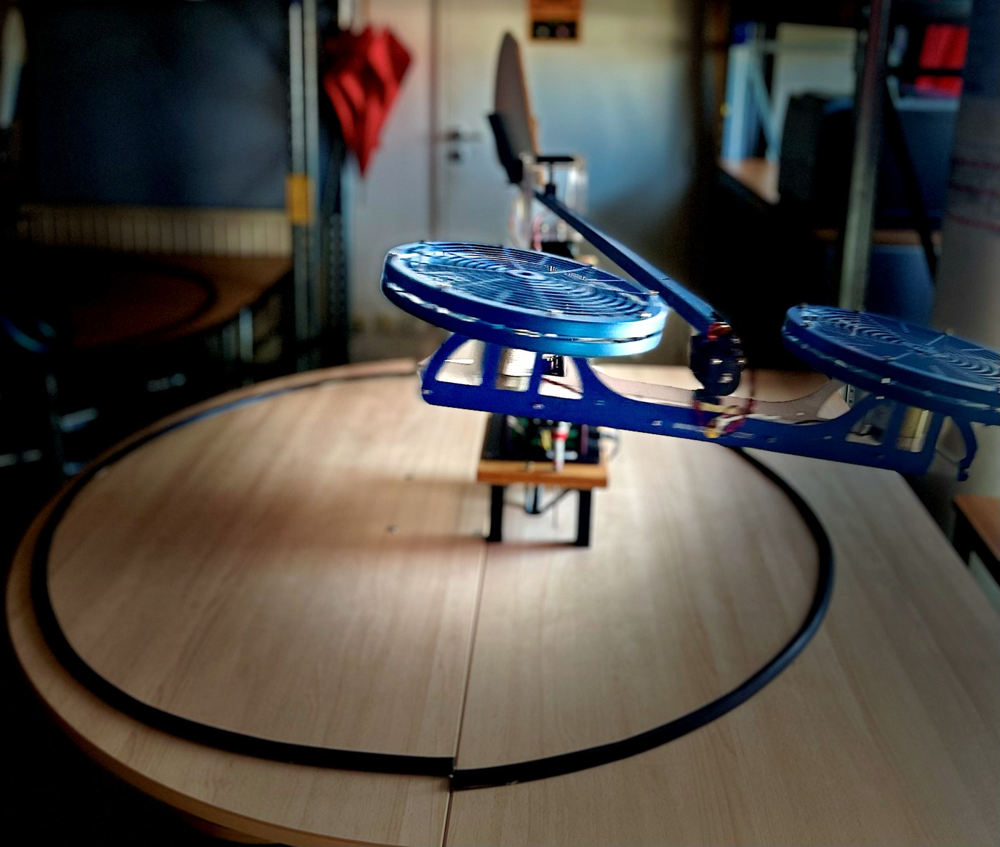
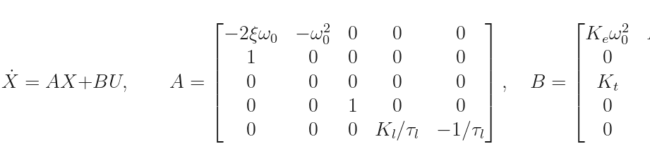
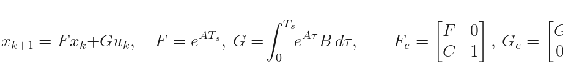
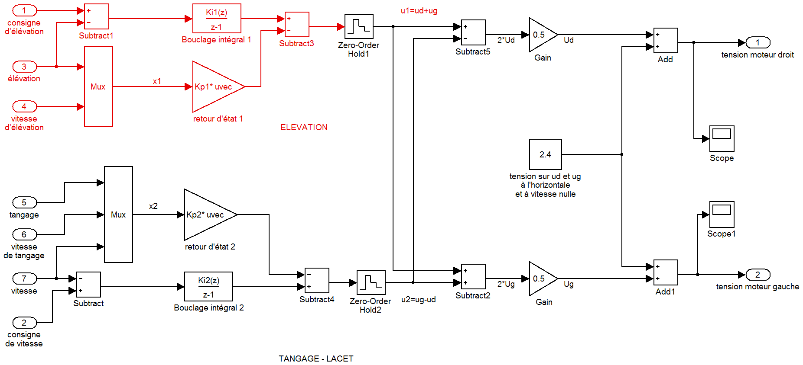
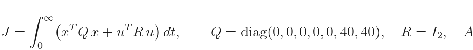
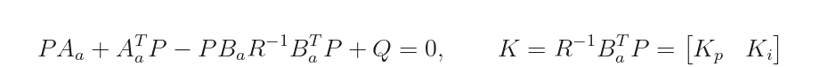
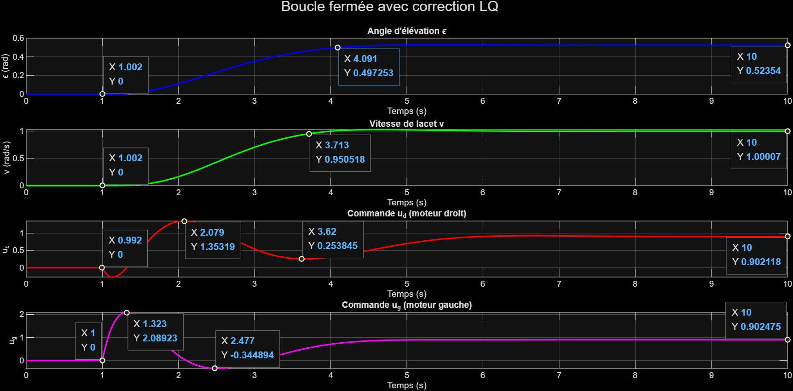
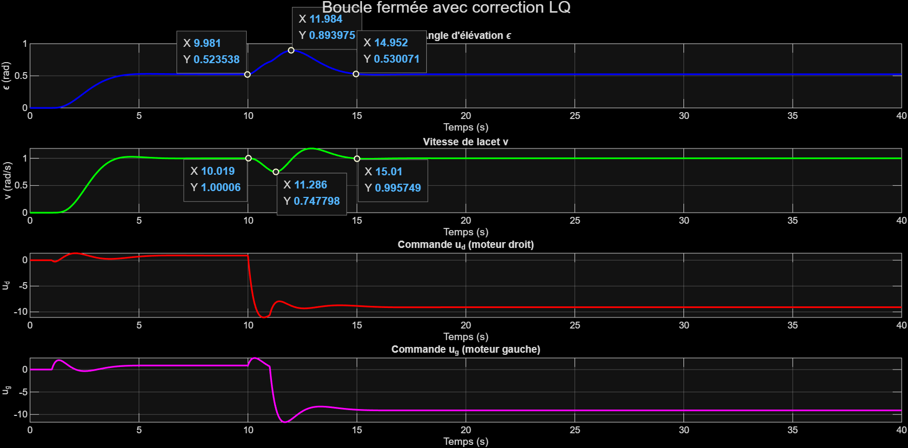

# Digital State-Feedback & LQR Control of a Twin-Rotor Helicopter


Experimental identification and modern state-space control of a **3-DoF twin-rotor helicopter** (elevation, pitch, yaw), taking the platform from open-loop step tests all the way to two real-time controllers running on dSPACE: a **discrete integral state-feedback controller designed by pole placement**, and a **multivariable LQR with integral action** — then comparing them head-to-head.

<p align="center">
  
  <br><em>The twin-rotor platform: two motor voltages (u_g, u_d) drive elevation through their sum and pitch through their difference; pitch then generates yaw through the arm geometry.</em>
</p>

## The plant: identified 5-state multivariable model

Each channel is identified experimentally in open loop: elevation is a lightly damped second-order mode (`ξ = 0.05`, `ω₀ = 0.7 rad/s`), pitch a double integrator (`K_t = 1.336`), and yaw an integrator + first-order lag (`K_l = −5.219`, `τ_l = 20 s`). Assembled together:

<p align="center">
  <picture>
    <source media="(prefers-color-scheme: dark)" srcset="docs/equations/eq1_plant_dark.png">
    
  </picture>
</p>

with regulated outputs (elevation angle `ε` and yaw rate `v`):

<p align="center">
  <picture>
    <source media="(prefers-color-scheme: dark)" srcset="docs/equations/eq2_outputs_dark.png">
    
  </picture>
</p>

The plant is structurally multivariable: the *sum* of the motor voltages drives elevation while their *difference* drives pitch, which in turn produces yaw — so any serious controller has to coordinate both inputs at once.

## Controller 1 — Integral state feedback by discrete pole placement

**Scope:** SISO elevation channel, digital implementation at `T_s = 0.05 s`.

The refined elevation model (`ξ = 0.0912`, `ω₀ = 0.8038 rad/s`, `K = 0.3299 rad/V`) is discretized with a zero-order hold and augmented with an integral state so a constant reference is tracked with **zero steady-state error**:

<p align="center">
  <picture>
    <source media="(prefers-color-scheme: dark)" srcset="docs/equations/eq6_discrete_dark.png">
    
  </picture>
</p>

Desired continuous poles are placed on a design horizon (`−1/T_c`), mapped to the z-plane (`z = e^{sT_s}`), and the gain is computed by **Ackermann's formula**. Two speed settings are compared:

| Design | Gains | Response time | Peak command |
|---|---|---|---|
| `T_c = 1 s` (nominal) | `K_p = [10.64  10.25]`, `K_i = 0.288` | ≈ 6 s (sim) / **5.78 s measured** | ≈ 1.9 V |
| `T_c = 0.5 s` (fast) | `K_p = [40.35  20.04]`, `K_i = 1.514` | ≈ 3 s | ≈ 3.3 V |

<p align="center">
  
  <br><em>The central pole-placement trade-off, measured: halving the response time nearly triples the peak actuator demand.</em>
</p>

Deployed in real time through **MATLAB/Simulink + dSPACE DS1103/1104**: measured response time 5.78 s (vs 6.2 s simulated), manual disturbances rejected in 4.41 s on average.

## Controller 2 — Multivariable LQR with integral action

**Scope:** MIMO — elevation and yaw rate regulated simultaneously, both motors coordinated.

The 5-state plant is augmented with **two integral states** (one per regulated output):

<p align="center">
  <picture>
    <source media="(prefers-color-scheme: dark)" srcset="docs/equations/eq3_augmented_dark.png">
    
  </picture>
</p>

The gain minimizes a quadratic cost where **only the integrated tracking errors are penalized** (`Q = diag(0,…,40,40)`), both motors are weighted equally (`R = I₂`), and a **spectral shift** `α_c = 0.5` guarantees every closed-loop pole lies left of `Re(s) = −0.5`:

<p align="center">
  <picture>
    <source media="(prefers-color-scheme: dark)" srcset="docs/equations/eq4_criterion_dark.png">
    
  </picture>
</p>

The optimal gain comes from the algebraic **Riccati equation**:

<p align="center">
  <picture>
    <source media="(prefers-color-scheme: dark)" srcset="docs/equations/eq5_riccati_dark.png">
    
  </picture>
</p>

**Results** — closed-loop eigenvalues `{−0.5607 ± 0.9945i, −0.6338 ± 1.3929i, −1.0098, −1.5259 ± 0.5786i}` (all comfortably left of the shift line); 5% response times ≈ **3.1 s (elevation)** and **2.7 s (yaw rate)**, no overshoot, no actuator saturation:

<p align="center">
  
  <br><em>Nominal multivariable tracking: both outputs and both motor commands.</em>
</p>

Robustness is tested with simultaneous 2-second rectangular disturbances injected on both channels — both outputs return to their references in ≈ 5 s without sustained oscillation, and real-time dSPACE tests reproduce the behavior:

<p align="center">
  
  <br><em>Simultaneous elevation + yaw channel disturbances, rejected in ≈ 5 s.</em>
</p>

## Head-to-head

| Criterion | Integral pole placement | Integral LQR |
|---|---|---|
| Scope | SISO elevation | MIMO elevation + yaw rate |
| Tuning handle | Pole locations / `T_c` | Weights `Q`, `R`, shift `α_c` |
| Steady-state error | Zero (1 integral state) | Zero (2 integral states) |
| Response | ≈ 6 s → ≈ 3 s (at 2.75× the voltage) | ≈ 3.1 s / 2.7 s, no saturation |
| Strength | Direct, transparent modal shaping | Systematic multivariable trade-off |
| Limitation | Gains blow up as speed increases | Only as good as the model & weight choice |

**Bottom line**: pole placement wins on transparency for a single dominant channel; LQR wins for the coupled platform, because it treats both motors and both outputs in one synthesis and formalizes the performance-vs-effort compromise instead of leaving it implicit.

## Repository layout

```
matlab/
├── integral_state_feedback_pole_placement.m   Controller 1: ZOH discretization, integral
│                                                augmentation, Ackermann placement, Tc=1s vs 0.5s
├── lqr_integral_control.m                     Controller 2: augmented LQR + spectral shift +
│                                                Riccati synthesis, runs the Simulink simulation
├── rebi.mdl                                   Closed-loop Simulink model (saved in R2026a)
└── rebi_r2010b.mdl                            Same model exported for R2010b compatibility

docs/
├── Helicopter_Control_Report.pdf              Full 20-page project report (identification,
│                                                synthesis, real-time validation, comparison)
├── images/                                    Figures used in this README
└── equations/                                 Pre-rendered equations (light/dark variants)
```

## How to run

```matlab
cd matlab
% Controller 1 — pole placement study (plots poles, responses, control effort)
integral_state_feedback_pole_placement

% Controller 2 — LQR synthesis + closed-loop Simulink simulation
lqr_integral_control       % runs sim('rebi') and plots ε, v, u_d, u_g
```

Requires MATLAB + Control System Toolbox + Simulink. `rebi.mdl` needs R2026a; on older releases open `rebi_r2010b.mdl` instead (rename it to `rebi.mdl` or adjust the `sim(...)` call).

> Note: display equations in this README are pre-rendered PNGs (light/dark variants) so they show correctly everywhere, including the GitHub mobile app, which does not render `$$` LaTeX.

## Authors & context

**Dev Kumar**, Steevy Doumbe Moundy, Léa Couësme — Arts et Métiers ParisTech (ENSAM), Mechatronics Expertise, supervised by Hervé Guillard, Nazih Mechbal, and Marc Rébillat. Real-time experiments on the dSPACE-instrumented twin-rotor platform (ENSAM / CNAM).

Full derivations, identification plots, and experimental traces: [`docs/Helicopter_Control_Report.pdf`](docs/Helicopter_Control_Report.pdf).

## License

MIT — see [LICENSE](LICENSE).
